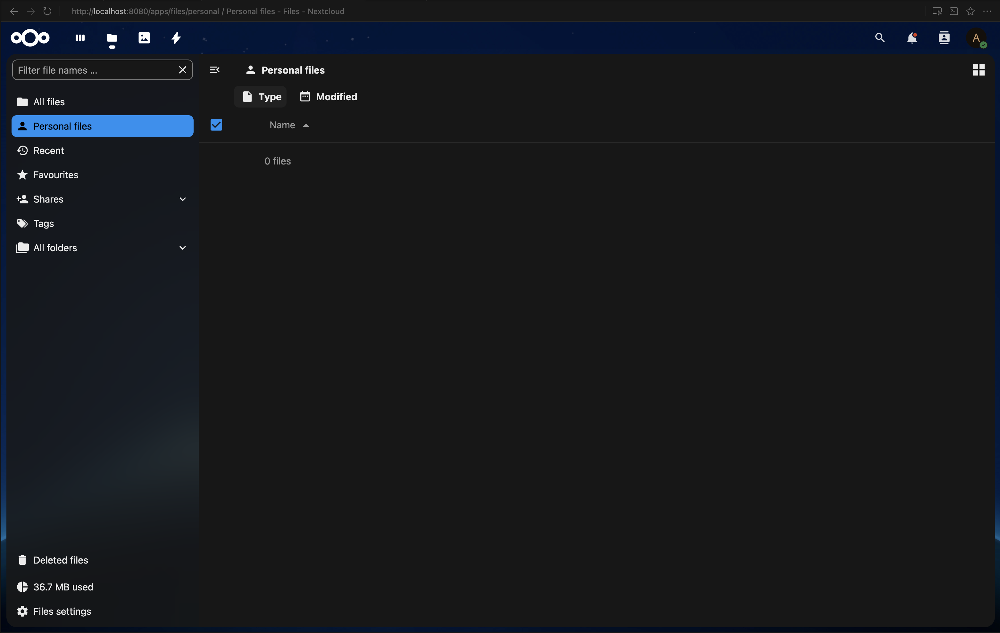

# Лабораторная работа №3: Kubernetes

## 1. Перенос POSTGRES_USER и POSTGRES_PASSWORD в Secret

### Создан новый манифест: `pg_secrets.yml`

```yaml
apiVersion: v1
kind: Secret
metadata:
  name: postgres-secret
  labels:
    app: nextcloud
type: Opaque
stringData:
  POSTGRES_USER: "postgres"
  POSTGRES_PASSWORD: "postgres"

### Изменения в `pg_configmap.yml`

**Удалено:**
```yaml
POSTGRES_USER: "postgres"
POSTGRES_PASSWORD: "postgres"
```

**Осталось только:**
```yaml
apiVersion: v1
kind: ConfigMap
metadata:
  name: postgres-configmap
  labels:
    app: postgres
data:
  POSTGRES_DB: "postgres"
```

### Изменения в `pg_deployment.yml`

Переменные `POSTGRES_USER` и `POSTGRES_PASSWORD` теперь берутся из Secret вместо ConfigMap:

**Было (configMapKeyRef):**
```yaml
env:
  - name: POSTGRES_USER
    valueFrom:
      configMapKeyRef:
        name: postgres-configmap
        key: POSTGRES_USER
  - name: POSTGRES_PASSWORD
    valueFrom:
      configMapKeyRef:
        name: postgres-configmap
        key: POSTGRES_PASSWORD
```

**Стало (secretKeyRef):**
```yaml
env:
  - name: POSTGRES_USER
    valueFrom:
      secretKeyRef:
        name: postgres-secret
        key: POSTGRES_USER
  - name: POSTGRES_PASSWORD
    valueFrom:
      secretKeyRef:
        name: postgres-secret
        key: POSTGRES_PASSWORD
```

---

## 2. Перенос переменных Nextcloud в ConfigMap

### Создан новый манифест: `nextcloud_configmap.yml`

```yaml
apiVersion: v1
kind: ConfigMap
metadata:
  name: nextcloud-configmap
  labels:
    app: nextcloud
data:
  NEXTCLOUD_UPDATE: "1"
  ALLOW_EMPTY_PASSWORD: "yes"
```

### Изменения в `nextcloud.yml`

Переменные `NEXTCLOUD_UPDATE` и `ALLOW_EMPTY_PASSWORD` вынесены из захардкоженных значений в ConfigMap:

**Было (hardcoded):**
```yaml
env:
  - name: NEXTCLOUD_UPDATE
    value: "1"
  - name: ALLOW_EMPTY_PASSWORD
    value: "yes"
```

**Стало (configMapKeyRef):**
```yaml
env:
  - name: NEXTCLOUD_UPDATE
    valueFrom:
      configMapKeyRef:
        name: nextcloud-configmap
        key: NEXTCLOUD_UPDATE
  - name: ALLOW_EMPTY_PASSWORD
    valueFrom:
      configMapKeyRef:
        name: nextcloud-configmap
        key: ALLOW_EMPTY_PASSWORD
```

---

## 3. Перенос NEXTCLOUD_ADMIN_USER и NEXTCLOUD_ADMIN_PASSWORD в Secret

### Изменения в `nextcloud.yml`

Переменные `NEXTCLOUD_ADMIN_USER` и `NEXTCLOUD_ADMIN_PASSWORD` теперь хранятся в Secret `nextcloud-secret`:

**Обновлен Secret в `nextcloud.yml`:**
```yaml
apiVersion: v1
kind: Secret
metadata:
  name: nextcloud-secret
  labels:
    app: nextcloud
type: Opaque
stringData:
    NEXTCLOUD_ADMIN_USER: "admin"
    NEXTCLOUD_ADMIN_PASSWORD: "literally_any_password"
```

**Было (hardcoded значения):**
```yaml
env:
  - name: NEXTCLOUD_ADMIN_USER
    value: "admin"
  - name: NEXTCLOUD_ADMIN_PASSWORD
    value: "literally_any_password"
```

**Стало (secretKeyRef):**
```yaml
env:
  - name: NEXTCLOUD_ADMIN_USER
    valueFrom:
      secretKeyRef:
        name: nextcloud-secret
        key: NEXTCLOUD_ADMIN_USER
  - name: NEXTCLOUD_ADMIN_PASSWORD
    valueFrom:
      secretKeyRef:
        name: nextcloud-secret
        key: NEXTCLOUD_ADMIN_PASSWORD
```

Теперь все секретные данные (логины и пароли) хранятся в Secret ресурсах:
- `postgres-secret`: содержит `POSTGRES_USER` и `POSTGRES_PASSWORD`
- `nextcloud-secret`: содержит `NEXTCLOUD_ADMIN_USER` и `NEXTCLOUD_ADMIN_PASSWORD`

---

## 4. Создание Service для Nextcloud

### Создан новый манифест: `nextcloud_service.yml`

```yaml
apiVersion: v1
kind: Service
metadata:
  name: nextcloud-service
  labels:
    app: nextcloud
spec:
  type: NodePort
  ports:
   - port: 80
     targetPort: 80
     protocol: TCP
     name: http
  selector:
   app: nextcloud
```

Service типа NodePort позволяет получить доступ к Nextcloud UI с вашего ноутбука без использования Ingress.

### Изменения в `nextcloud.yml`

Обновлена переменная `NEXTCLOUD_TRUSTED_DOMAINS` для поддержки внешнего доступа:

**Было:**
```yaml
- name: NEXTCLOUD_TRUSTED_DOMAINS
  value: "127.0.0.1"
```

**Стало:**
```yaml
- name: NEXTCLOUD_TRUSTED_DOMAINS
  value: "127.0.0.1 localhost"
```

---

## 5. Добавление Liveness и Readiness проб для Nextcloud

### Изменения в `nextcloud.yml`

Добавлены пробы для проверки состояния контейнера:

```yaml
livenessProbe:
  httpGet:
    path: /status.php
    port: 80
    httpHeaders:
    - name: Host
      value: localhost
  initialDelaySeconds: 60
  periodSeconds: 30
  timeoutSeconds: 5
  failureThreshold: 3
readinessProbe:
  httpGet:
    path: /status.php
    port: 80
    httpHeaders:
    - name: Host
      value: localhost
  initialDelaySeconds: 30
  periodSeconds: 10
  timeoutSeconds: 5
  failureThreshold: 3
```

**Параметры проб:**
- `livenessProbe` — проверяет, жив ли контейнер. При неудаче контейнер перезапускается.
- `readinessProbe` — проверяет, готов ли контейнер принимать трафик.
- `initialDelaySeconds` — задержка перед первой проверкой (60 сек для liveness, 30 сек для readiness)
- `periodSeconds` — интервал между проверками
- `failureThreshold` — количество неудачных проверок до срабатывания

## Порядок применения манифестов

### 1. Применяем ConfigMaps и Secrets
```bash
kubectl apply -f pg_configmap.yml
kubectl apply -f pg_secrets.yml
kubectl apply -f nextcloud_configmap.yml
```


### 2. Применяем PostgreSQL
```bash
kubectl apply -f pg_deployment.yml
kubectl apply -f pg_service.yml
```


### 3. Применяем Nextcloud
```bash
kubectl apply -f nextcloud.yml
kubectl apply -f nextcloud_service.yml
```


### 4. Проверяем статус подов
```bash
kubectl get pods
```


---

## Доступ к Nextcloud UI

### Выполненные действия

#### 1. Создание Service для Nextcloud

**Действия:**
- Создан новый манифест `nextcloud_service.yml` с определением Service типа `NodePort`
- Service настроен на проброс порта 80 контейнера Nextcloud на внешний порт кластера
- Service использует селектор `app: nextcloud` для маршрутизации трафика к подам

**Содержимое `nextcloud_service.yml`:**
```yaml
apiVersion: v1
kind: Service
metadata:
  name: nextcloud-service
  labels:
    app: nextcloud
spec:
  type: NodePort
  ports:
   - port: 80
     targetPort: 80
     protocol: TCP
     name: http
  selector:
   app: nextcloud
```

**Применение:**
```bash
kubectl apply -f nextcloud_service.yml
```

#### 2. Обновление конфигурации Nextcloud для внешнего доступа

**Действия:**
- Обновлена переменная окружения `NEXTCLOUD_TRUSTED_DOMAINS` в манифесте `nextcloud.yml`
- Добавлен `localhost` в список доверенных доменов (ранее был только `127.0.0.1`)

**Изменения в `nextcloud.yml`:**
```yaml
# Было:
- name: NEXTCLOUD_TRUSTED_DOMAINS
  value: "127.0.0.1"

# Стало:
- name: NEXTCLOUD_TRUSTED_DOMAINS
  value: "127.0.0.1 localhost"
```

**Применение:**
```bash
kubectl apply -f nextcloud.yml
```

#### 3. Проброс порта Service на локальный хост
Использование `kubectl port-forward` для проброса порта Service на локальный хост:

```bash
kubectl port-forward svc/nextcloud-service 8080:80
```

#### 4. Доступ к Nextcloud UI


---

## Дополнительные вопросы

### Вопрос 1: Важен ли порядок выполнения этих манифестов? Почему?

**Ответ:**

Да, порядок выполнения манифестов **важен**, и вот почему:

#### Правильный порядок применения:

1. **Сначала ConfigMaps и Secrets:**
   ```bash
   kubectl apply -f pg_configmap.yml
   kubectl apply -f pg_secrets.yml
   kubectl apply -f nextcloud_configmap.yml
   ```

2. **Затем PostgreSQL:**
   ```bash
   kubectl apply -f pg_deployment.yml
   kubectl apply -f pg_service.yml
   ```

3. **И только потом Nextcloud:**
   ```bash
   kubectl apply -f nextcloud.yml
   kubectl apply -f nextcloud_service.yml
   ```

#### Почему порядок важен:

1. **Зависимости ресурсов:**
   - Deployment манифесты ссылаются на ConfigMap и Secret через `configMapKeyRef` и `secretKeyRef`
   - Если применить Deployment до создания ConfigMap/Secret, Kubernetes не сможет найти эти ресурсы
   - Под не сможет запуститься и будет в состоянии `Pending` или `Error` с сообщением о том, что не найден ConfigMap/Secret

2. **Зависимости между приложениями:**
   - Nextcloud зависит от PostgreSQL (переменная `POSTGRES_HOST: postgres-service`)
   - Если Nextcloud запустится раньше PostgreSQL, он не сможет подключиться к базе данных
   - Nextcloud будет пытаться подключиться к несуществующему сервису и будет падать с ошибками подключения

3. **DNS разрешение:**
   - Service создает DNS запись в кластере (`postgres-service`)
   - Если Nextcloud запустится до создания Service PostgreSQL, DNS запись не будет существовать
   - Nextcloud не сможет разрешить имя `postgres-service` в IP адрес

4. **Инициализация базы данных:**
   - PostgreSQL должен быть полностью готов и принимать подключения перед запуском Nextcloud
   - Nextcloud выполняет миграции базы данных при первом запуске
   - Если база данных недоступна, Nextcloud не сможет инициализироваться

#### Что произойдет при неправильном порядке:

- Если применить Nextcloud до PostgreSQL:
  - Nextcloud поды будут в состоянии `CrashLoopBackOff`
  - В логах будут ошибки подключения к базе данных: `could not translate host name "postgres-service"`, `connection refused`
  - Nextcloud не сможет работать до тех пор, пока PostgreSQL не будет запущен и готов

- Если применить Deployment до ConfigMap/Secret:
  - Поды не смогут запуститься
  - Kubernetes будет показывать события типа: `Failed to pull secret "postgres-secret": secret not found`
  - Поды останутся в состоянии `Pending`

#### Рекомендация:

Всегда применяйте манифесты в порядке зависимостей: сначала базовые ресурсы (ConfigMap, Secret), затем зависимости (PostgreSQL), и только потом приложения, которые от них зависят (Nextcloud).

---

### Вопрос 2: Что (и почему) произойдет, если отскейлить количество реплик postgres-deployment в 0, затем обратно в 1, после чего попробовать снова зайти на Nextcloud?

**Ответ:**

#### Сценарий выполнения:

1. **Масштабирование PostgreSQL до 0 реплик:**
   ```bash
   kubectl scale deployment postgres --replicas=0
   ```

2. **Масштабирование обратно до 1 реплики:**
   ```bash
   kubectl scale deployment postgres --replicas=1
   ```

3. **Попытка доступа к Nextcloud**

#### Что произойдет:

##### Этап 1: PostgreSQL масштабирован до 0 реплик

- **Все поды PostgreSQL будут удалены**
- **Service `postgres-service` останется**, но не будет иметь endpoints (нет подов для маршрутизации трафика)
- **Nextcloud продолжит работать**, но:
  - При попытке выполнить любую операцию с базой данных получит ошибку подключения
  - Существующие подключения к БД будут разорваны
  - Nextcloud может показать ошибки типа "Database connection failed" или "Service unavailable"
  - Пользователи не смогут войти в систему или работать с данными

##### Этап 2: PostgreSQL масштабирован обратно до 1 реплики

- **Создается новый под PostgreSQL**
- **Важно**: Это будет **новый под с новой файловой системой**
- **База данных будет пустой** - все данные, созданные ранее, будут потеряны
- **PostgreSQL инициализирует новую пустую базу данных** с начальными настройками
- **Service `postgres-service` снова получит endpoint** и сможет маршрутизировать трафик

##### Этап 3: Попытка доступа к Nextcloud

**Возможны два сценария:**

**Сценарий А: Nextcloud под не перезапускался**
- Nextcloud попытается использовать **старые подключения к БД** (которые были разорваны)
- При первой попытке доступа Nextcloud обнаружит, что база данных недоступна или пуста
- Nextcloud может показать ошибку инициализации или страницу с ошибкой подключения к БД
- **Данные пользователей будут потеряны**, так как база данных была пересоздана

**Сценарий Б: Nextcloud под перезапустился (например, из-за liveness probe)**
- Nextcloud попытается подключиться к новой базе данных
- Так как база данных пустая, Nextcloud может:
  - Показать страницу первоначальной настройки (если это первый запуск)
  - Показать ошибку, что база данных не инициализирована
  - Потребовать повторной настройки администратора

#### Почему это происходит:

1. **Stateless vs Stateful:**
   - PostgreSQL Deployment использует обычные volumes (если не указан PersistentVolume)
   - При удалении пода все данные в его файловой системе теряются
   - Новый под получает новую пустую файловую систему

2. **Отсутствие PersistentVolume:**
   - В текущей конфигурации PostgreSQL не использует PersistentVolumeClaim
   - Данные хранятся только в файловой системе пода
   - При удалении пода данные теряются безвозвратно

3. **Service и DNS:**
   - Service продолжает существовать и маршрутизировать трафик
   - Но когда нет подов, Service не имеет endpoints
   - После создания нового пода Service автоматически получает новый endpoint

4. **Nextcloud и подключения:**
   - Nextcloud может кэшировать подключения к БД
   - При разрыве соединения Nextcloud может не сразу обнаружить проблему
   - При переподключении Nextcloud обнаружит, что база данных пустая или структура не соответствует ожидаемой

#### Как избежать потери данных:

Для предотвращения потери данных при масштабировании необходимо:

1. **Использовать PersistentVolumeClaim:**
   ```yaml
   volumes:
   - name: postgres-storage
     persistentVolumeClaim:
       claimName: postgres-pvc
   ```

2. **Использовать StatefulSet вместо Deployment** для stateful приложений:
   - StatefulSet обеспечивает стабильные имена подов
   - Лучше подходит для баз данных

3. **Регулярные бэкапы базы данных:**
   - Настроить автоматические бэкапы PostgreSQL
   - Восстанавливать данные из бэкапа при необходимости

#### Вывод:

При масштабировании PostgreSQL до 0 и обратно до 1 реплики **все данные будут потеряны**, так как создается новый под с новой файловой системой. Nextcloud либо не сможет подключиться к базе данных, либо потребует повторной инициализации, так как база данных будет пустой. Это демонстрирует важность использования PersistentVolume для stateful приложений в Kubernetes.
