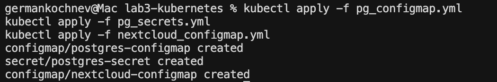
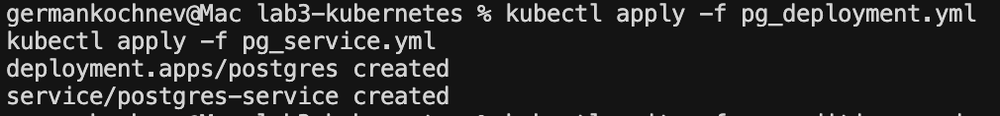
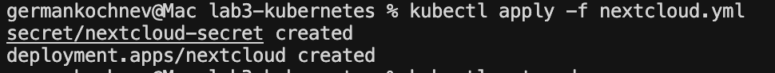
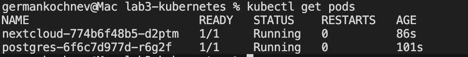

# Лабораторная работа №3: Kubernetes

## 1. Перенос POSTGRES_USER и POSTGRES_PASSWORD в Secret

### Создан новый манифест: `pg_secrets.yml`

```yaml
apiVersion: v1
kind: Secret
metadata:
  name: postgres-secret
  labels:
    app: nextcloud
type: Opaque
stringData:
  POSTGRES_USER: "postgres"
  POSTGRES_PASSWORD: "postgres"

### Изменения в `pg_configmap.yml`

**Удалено:**
```yaml
POSTGRES_USER: "postgres"
POSTGRES_PASSWORD: "postgres"
```

**Осталось только:**
```yaml
apiVersion: v1
kind: ConfigMap
metadata:
  name: postgres-configmap
  labels:
    app: postgres
data:
  POSTGRES_DB: "postgres"
```

### Изменения в `pg_deployment.yml`

Переменные `POSTGRES_USER` и `POSTGRES_PASSWORD` теперь берутся из Secret вместо ConfigMap:

**Было (configMapKeyRef):**
```yaml
env:
  - name: POSTGRES_USER
    valueFrom:
      configMapKeyRef:
        name: postgres-configmap
        key: POSTGRES_USER
  - name: POSTGRES_PASSWORD
    valueFrom:
      configMapKeyRef:
        name: postgres-configmap
        key: POSTGRES_PASSWORD
```

**Стало (secretKeyRef):**
```yaml
env:
  - name: POSTGRES_USER
    valueFrom:
      secretKeyRef:
        name: postgres-secret
        key: POSTGRES_USER
  - name: POSTGRES_PASSWORD
    valueFrom:
      secretKeyRef:
        name: postgres-secret
        key: POSTGRES_PASSWORD
```

---

## 2. Перенос переменных Nextcloud в ConfigMap

### Создан новый манифест: `nextcloud_configmap.yml`

```yaml
apiVersion: v1
kind: ConfigMap
metadata:
  name: nextcloud-configmap
  labels:
    app: nextcloud
data:
  NEXTCLOUD_UPDATE: "1"
  ALLOW_EMPTY_PASSWORD: "yes"
```

### Изменения в `nextcloud.yml`

Переменные `NEXTCLOUD_UPDATE` и `ALLOW_EMPTY_PASSWORD` вынесены из захардкоженных значений в ConfigMap:

**Было (hardcoded):**
```yaml
env:
  - name: NEXTCLOUD_UPDATE
    value: "1"
  - name: ALLOW_EMPTY_PASSWORD
    value: "yes"
```

**Стало (configMapKeyRef):**
```yaml
env:
  - name: NEXTCLOUD_UPDATE
    valueFrom:
      configMapKeyRef:
        name: nextcloud-configmap
        key: NEXTCLOUD_UPDATE
  - name: ALLOW_EMPTY_PASSWORD
    valueFrom:
      configMapKeyRef:
        name: nextcloud-configmap
        key: ALLOW_EMPTY_PASSWORD
```

---

## 3. Добавление Liveness и Readiness проб для Nextcloud

### Изменения в `nextcloud.yml`

Добавлены пробы для проверки состояния контейнера:

```yaml
livenessProbe:
  httpGet:
    path: /status.php
    port: 80
    httpHeaders:
    - name: Host
      value: localhost
  initialDelaySeconds: 60
  periodSeconds: 30
  timeoutSeconds: 5
  failureThreshold: 3
readinessProbe:
  httpGet:
    path: /status.php
    port: 80
    httpHeaders:
    - name: Host
      value: localhost
  initialDelaySeconds: 30
  periodSeconds: 10
  timeoutSeconds: 5
  failureThreshold: 3
```

**Параметры проб:**
- `livenessProbe` — проверяет, жив ли контейнер. При неудаче контейнер перезапускается.
- `readinessProbe` — проверяет, готов ли контейнер принимать трафик.
- `initialDelaySeconds` — задержка перед первой проверкой (60 сек для liveness, 30 сек для readiness)
- `periodSeconds` — интервал между проверками
- `failureThreshold` — количество неудачных проверок до срабатывания

## Порядок применения манифестов

### 1. Применяем ConfigMaps и Secrets
```bash
kubectl apply -f pg_configmap.yml
kubectl apply -f pg_secrets.yml
kubectl apply -f nextcloud_configmap.yml
```


### 2. Применяем PostgreSQL
```bash
kubectl apply -f pg_deployment.yml
kubectl apply -f pg_service.yml
```


### 3. Применяем Nextcloud
```bash
kubectl apply -f nextcloud.yml
```


### 4. Проверяем статус подов
```bash
kubectl get pods
```
