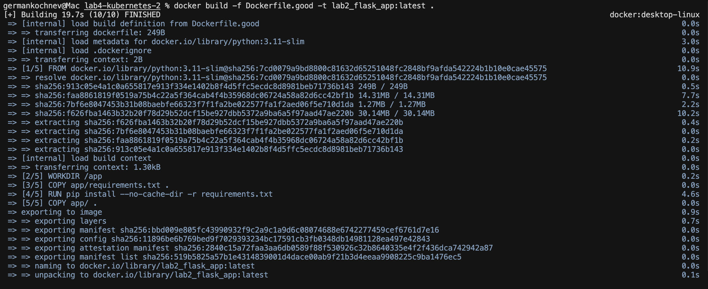
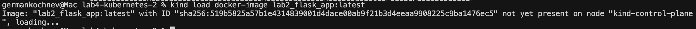
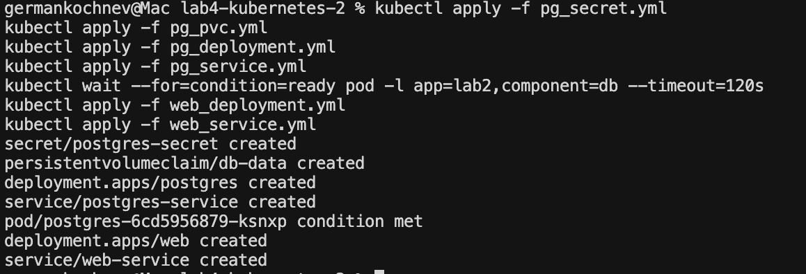
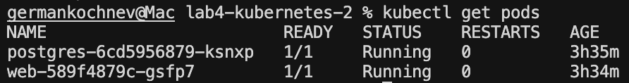

# Лабораторная работа №4: Миграция Docker Compose в Kubernetes

Взяли проект из предыдущей лабораторной работы ЛР2 и перенесли его в Kubernetes.

## 1. Создание Secret для хранения учетных данных базы данных

### Создан новый манифест: `pg_secret.yml`

В Docker Compose учетные данные хранились в файле `.env`:

**Было (docker-compose.yml):**
```yaml
services:
  db:
    env_file:
      - .env
```

**Стало (pg_secret.yml):**
```yaml
apiVersion: v1
kind: Secret
metadata:
  name: postgres-secret
  labels:
    app: lab2
type: Opaque
stringData:
  POSTGRES_USER: "postgres"
  POSTGRES_PASSWORD: "postgres"
  POSTGRES_DB: "lab2db"
```

### Использование секретов в `pg_deployment.yml`

Переменные окружения берутся из Secret через `secretKeyRef`:

```yaml
env:
- name: POSTGRES_USER
  valueFrom:
    secretKeyRef:
      name: postgres-secret
      key: POSTGRES_USER
- name: POSTGRES_PASSWORD
  valueFrom:
    secretKeyRef:
      name: postgres-secret
      key: POSTGRES_PASSWORD
- name: POSTGRES_DB
  valueFrom:
    secretKeyRef:
      name: postgres-secret
      key: POSTGRES_DB
```

---

## 2. Создание PersistentVolumeClaim для хранения данных базы данных

### Создан новый манифест: `pg_pvc.yml`

**Было (docker-compose.yml):**
```yaml
services:
  db:
    volumes:
      - db_data:/var/lib/postgresql/data

volumes:
  db_data:
```

**Стало (pg_pvc.yml):**
```yaml
apiVersion: v1
kind: PersistentVolumeClaim
metadata:
  name: db-data
  labels:
    app: lab2
spec:
  accessModes:
    - ReadWriteOnce
  resources:
    requests:
      storage: 1Gi
```

### Использование PVC в `pg_deployment.yml`

```yaml
volumeMounts:
- name: db-storage
  mountPath: /var/lib/postgresql/data
volumes:
- name: db-storage
  persistentVolumeClaim:
    claimName: db-data
```

---

## 3. Развертывание PostgreSQL базы данных

### Манифест: `pg_deployment.yml`

**Было (docker-compose.yml):**
```yaml
services:
  db:
    image: postgres:16
    container_name: lab2_db
    env_file:
      - .env
    volumes:
      - db_data:/var/lib/postgresql/data
    healthcheck:
      test: ["CMD-SHELL", "pg_isready -U $${POSTGRES_USER} -d $${POSTGRES_DB}"]
      interval: 30s
      timeout: 5s
      retries: 5
```

**Стало (pg_deployment.yml):**
```yaml
apiVersion: apps/v1
kind: Deployment
metadata:
  name: postgres
  labels:
    app: lab2
    component: db
spec:
  replicas: 1
  selector:
    matchLabels:
      app: lab2
      component: db
  template:
    metadata:
      labels:
        app: lab2
        component: db
    spec:
      containers:
      - name: postgres
        image: postgres:16
        ports:
        - containerPort: 5432
          name: postgres
        env:
        - name: POSTGRES_USER
          valueFrom:
            secretKeyRef:
              name: postgres-secret
              key: POSTGRES_USER
        - name: POSTGRES_PASSWORD
          valueFrom:
            secretKeyRef:
              name: postgres-secret
              key: POSTGRES_PASSWORD
        - name: POSTGRES_DB
          valueFrom:
            secretKeyRef:
              name: postgres-secret
              key: POSTGRES_DB
        volumeMounts:
        - name: db-storage
          mountPath: /var/lib/postgresql/data
        livenessProbe:
          exec:
            command:
            - /bin/sh
            - -c
            - pg_isready -U $(POSTGRES_USER) -d $(POSTGRES_DB)
          initialDelaySeconds: 30
          periodSeconds: 30
          timeoutSeconds: 5
          failureThreshold: 5
        readinessProbe:
          exec:
            command:
            - /bin/sh
            - -c
            - pg_isready -U $(POSTGRES_USER) -d $(POSTGRES_DB)
          initialDelaySeconds: 5
          periodSeconds: 10
          timeoutSeconds: 5
          failureThreshold: 5
      volumes:
      - name: db-storage
        persistentVolumeClaim:
          claimName: db-data
```

**Изменения:**
- `healthcheck` преобразован в `livenessProbe` и `readinessProbe`
- Переменные окружения из `env_file` заменены на `secretKeyRef`
- Именованный volume заменен на `PersistentVolumeClaim`

### Манифест: `pg_service.yml`

```yaml
apiVersion: v1
kind: Service
metadata:
  name: postgres-service
  labels:
    app: lab2
    component: db
spec:
  type: ClusterIP
  ports:
  - port: 5432
    targetPort: 5432
    protocol: TCP
    name: postgres
  selector:
    app: lab2
    component: db
```

---

## 4. Инициализация базы данных через Init Container

**Было (docker-compose.yml):**
```yaml
services:
  init-db:
    image: postgres:16
    container_name: lab2_init_db
    env_file:
      - .env
    depends_on:
      db:
        condition: service_healthy
    command: >
      bash -c "PGPASSWORD=$$POSTGRES_PASSWORD psql -h db -U $$POSTGRES_USER -d $$POSTGRES_DB
      -v ON_ERROR_STOP=1
      -c \"CREATE TABLE IF NOT EXISTS items (id SERIAL PRIMARY KEY, name TEXT);
      TRUNCATE TABLE items;
      INSERT INTO items (name) VALUES ('item1'), ('item2'), ('item3');\""
    restart: "no"
```

**Стало (web_deployment.yml):**
```yaml
initContainers:
- name: init-db
  image: postgres:16
  command:
  - /bin/bash
  - -c
  - |
    set -e
    echo "Waiting for database to be ready..."
    until PGPASSWORD=$POSTGRES_PASSWORD psql -h postgres-service -U $POSTGRES_USER -d $POSTGRES_DB -c '\q' 2>/dev/null; do
      echo "Database is unavailable - sleeping"
      sleep 2
    done
    echo "Database is ready - initializing schema and data..."
    PGPASSWORD=$POSTGRES_PASSWORD psql -h postgres-service -U $POSTGRES_USER -d $POSTGRES_DB -v ON_ERROR_STOP=1 <<EOF
    CREATE TABLE IF NOT EXISTS items (id SERIAL PRIMARY KEY, name TEXT);
    TRUNCATE TABLE items;
    INSERT INTO items (name) VALUES ('item1'), ('item2'), ('item3');
    EOF
    echo "Database initialization completed!"
  env:
  - name: POSTGRES_USER
    valueFrom:
      secretKeyRef:
        name: postgres-secret
        key: POSTGRES_USER
  - name: POSTGRES_PASSWORD
    valueFrom:
      secretKeyRef:
        name: postgres-secret
        key: POSTGRES_PASSWORD
  - name: POSTGRES_DB
    valueFrom:
      secretKeyRef:
        name: postgres-secret
        key: POSTGRES_DB
```

**Изменения:**
- `depends_on` с `condition: service_healthy` заменен на явную проверку готовности БД в скрипте
- `restart: "no"` не требуется — init container выполняется один раз автоматически

---

## 5. Развертывание Flask веб-приложения

### Манифест: `web_deployment.yml`

**Было (docker-compose.yml):**
```yaml
services:
  web:
    build:
      context: .
      dockerfile: Dockerfile.good
    image: lab2_flask_app
    container_name: lab2_web
    env_file:
      - .env
    ports:
      - "${WEB_PORT}:5000"
    depends_on:
      - db
    healthcheck:
      test: ["CMD", "python", "-c", "import urllib.request; urllib.request.urlopen('http://localhost:5000/').read()"]
      interval: 30s
      timeout: 5s
      retries: 3
    command: ["python", "app.py"]
```

**Стало (web_deployment.yml):**
```yaml
apiVersion: apps/v1
kind: Deployment
metadata:
  name: web
  labels:
    app: lab2
    component: web
spec:
  replicas: 1
  selector:
    matchLabels:
      app: lab2
      component: web
  template:
    metadata:
      labels:
        app: lab2
        component: web
    spec:
      initContainers:
      # ... (см. раздел 4)
      containers:
      - name: web
        image: lab2_flask_app:latest
        imagePullPolicy: IfNotPresent
        ports:
        - containerPort: 5000
          name: http
        env:
        - name: POSTGRES_USER
          valueFrom:
            secretKeyRef:
              name: postgres-secret
              key: POSTGRES_USER
        - name: POSTGRES_PASSWORD
          valueFrom:
            secretKeyRef:
              name: postgres-secret
              key: POSTGRES_PASSWORD
        - name: POSTGRES_DB
          valueFrom:
            secretKeyRef:
              name: postgres-secret
              key: POSTGRES_DB
        - name: DB_HOST
          value: postgres-service
        command: ["python", "app.py"]
        livenessProbe:
          exec:
            command:
            - /bin/sh
            - -c
            - python -c "import urllib.request; urllib.request.urlopen('http://localhost:5000/').read()"
          initialDelaySeconds: 30
          periodSeconds: 30
          timeoutSeconds: 5
          failureThreshold: 3
        readinessProbe:
          exec:
            command:
            - /bin/sh
            - -c
            - python -c "import urllib.request; urllib.request.urlopen('http://localhost:5000/').read()"
          initialDelaySeconds: 10
          periodSeconds: 10
          timeoutSeconds: 5
          failureThreshold: 3
```

### Манифест: `web_service.yml`

В Docker Compose порты пробрасывались напрямую, в Kubernetes требуется Service:

```yaml
apiVersion: v1
kind: Service
metadata:
  name: web-service
  labels:
    app: lab2
    component: web
spec:
  type: ClusterIP
  ports:
  - port: 5000
    targetPort: 5000
    protocol: TCP
    name: http
  selector:
    app: lab2
    component: web
```

## Порядок применения манифестов

### 1. Подготовка Docker образа

Перед развертыванием необходимо собрать Docker образ и загрузить его в kind кластер:

```bash
# Сборка образа
docker build -f Dockerfile.good -t lab2_flask_app:latest .

# Загрузка образа в kind кластер
kind load docker-image lab2_flask_app:latest
```



### 2. Применяем манифесты

```bash
kubectl apply -f pg_secret.yml
kubectl apply -f pg_pvc.yml
kubectl apply -f pg_deployment.yml
kubectl apply -f pg_service.yml
kubectl wait --for=condition=ready pod -l app=lab2,component=db --timeout=120s
kubectl apply -f web_deployment.yml
kubectl apply -f web_service.yml
```


Init Container автоматически выполнит инициализацию базы данных перед запуском основного контейнера.

### 3. Проверяем статус подов

```bash
kubectl get pods
```

---

## Доступ к приложению

### Использование Port Forwarding

```bash
kubectl port-forward service/web-service 8080:5000
```

### Проверка эндпоинтов:

```bash
curl http://localhost:8080/items
```
